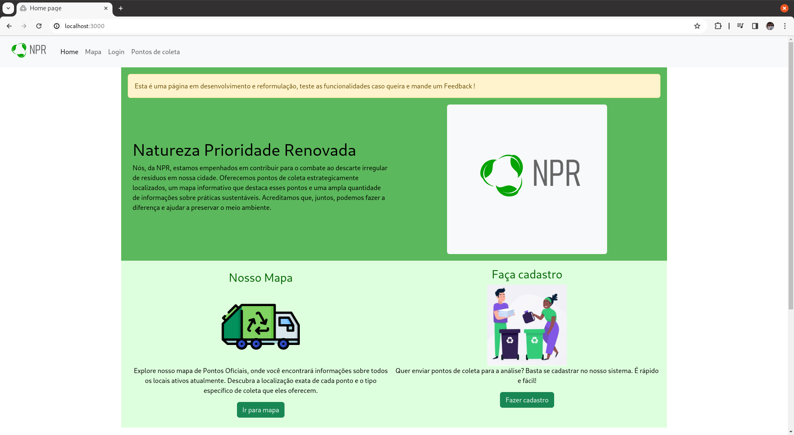
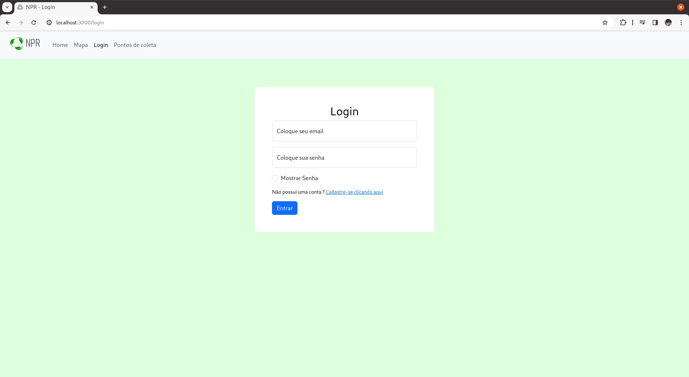
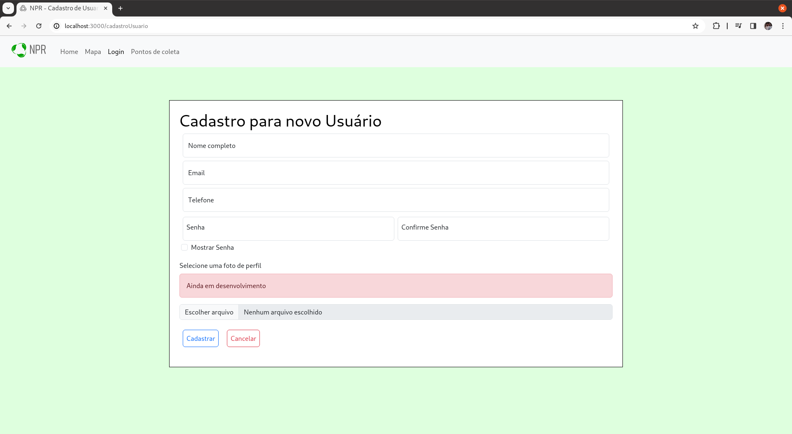
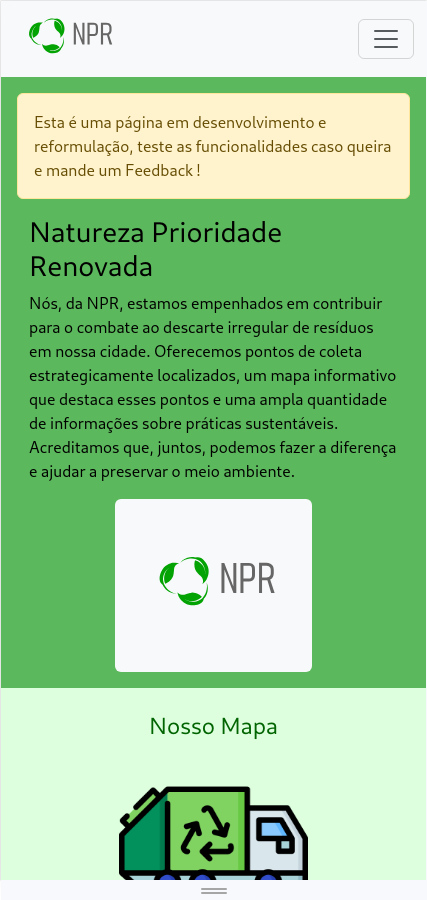
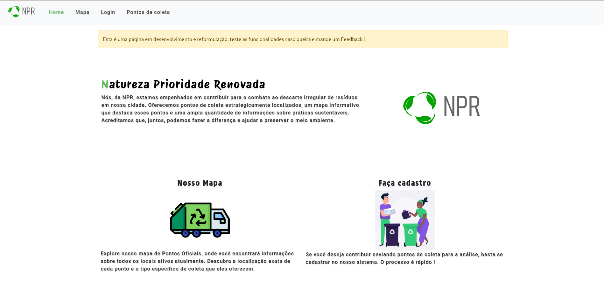
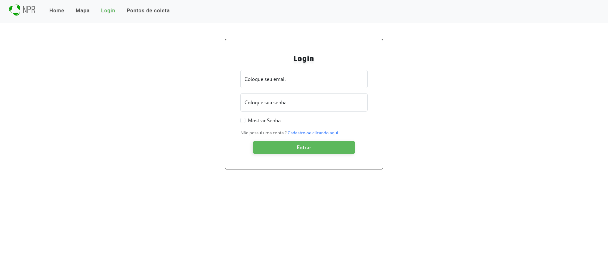
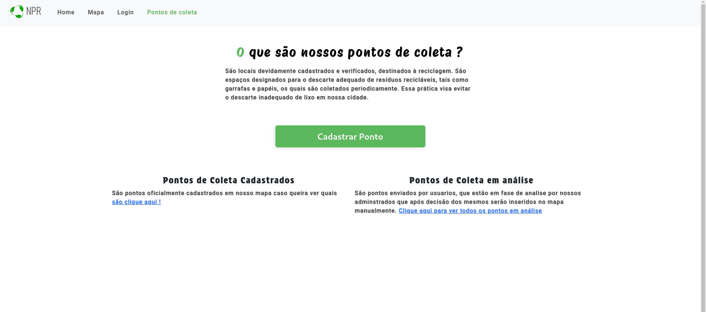

<div style="font-family: Arial;">

# Natureza Prioridade Renovada - NPR

- [Sobre](#sobre)
- [Objetivo](#objetivo)
- [Público-Alvo](#público-alvo)
- [considerações](#avisos)
- [Funcionalidades](#funcionalidades)
- [Tecnologias](#tecnologias)
- [Screenshots](#screenshots)
- [Como Rodar o Projeto](#como-rodar-o-projeto)
- [Atualizações](#Atualizações)


## Sobre
<p style="font-size: 1.3rem">A aplicação NPR é um projeto desenvolvido por um grupo de estudantes com o objetivo de facilitar a coleta de lixo reciclável e apoiar iniciativas de proteção ao meio ambiente. A plataforma visa oferecer assistência e combate ao descarte irregular de resíduos, promovendo o compartilhamento de informações e um sistema de coleta especializada.</p>

## Objetivo
<p style="font-size: 1.3rem">O principal objetivo da aplicação NPR é proporcionar uma plataforma que facilite a coleta de lixo reciclável, combata o descarte irregular de resíduos e apoie a proteção ao meio ambiente.</p>

## Público-Alvo
<p style="font-size: 1.3rem">A aplicação NPR é destinada ao público em geral, atendendo a todos os públicos interessados em contribuir para a proteção do meio ambiente e a coleta eficiente de lixo reciclável.</p>

## considerações
<p style="font-size: 1.3rem">Atualmente ele está em uma etapa bem avançada mas ainda possui seus pontos a serem melhorados, estou sempre pensando em novas coisas que posso fazer para tornar este projeto maior !</p>

## Funcionalidades
- **Cadastro de Usuário:**
   - <p style="font-size: 1.3rem;">Utilizando o banco de dados relacional MySQL, o cadastro de usuários é feito usando o Sequelize, sendo uma forma simples de fazer a comunicação com o banco de dados através do Node.js.</p>

- **Cadastro de Pontos de Coleta:**
   - <p style="font-size: 1.3rem;">Também utilizando o Sequelize, para que seja cadastrado, o usuário deve ter um cadastro ativo no sistema para assim poder continuar a execução do cadastro.</p>

- **Mapa com Pontos de Coleta Oficiais:**
   - <p style="font-size: 1.3rem;">Utilizando a API do Google Maps, podemos mostrar pontos de coleta funcionais em Barueri.</p>

- **Feedback:**
   - <p style="font-size: 1.3rem;">Uma área no fim da página inicial para que o usuário possa enviar um comentário ou feedback.</p>

## Tecnologias
- HTML
- CSS
- EJS
- Node.js
- Javascript
- MySQL
- Sequelize
- Bootstrap

## Screenshots ( versão antiga)
| Página Inicial no deskptop | Página de login no desktop | Página de cadastro no desktop | Página Inicial (Mobile) |
|:--------------:|:--------------:|:--------------:|:------------------------:|
|  |  |  |  |

## Como Rodar o Projeto
**Certifique-se de ter o Node instalado em sua máquina.**

### Clone o Repositório e vá para ele
```bash
git clone https://github.com/LacamJC/NewNPR.git
cd NewNPR 
```

### Certifique-se de ter o node instalado
```bash
   sudo apt-get update
   sudo apt-get install nodejs
```

Caso seu sistema seja Windows acesse o [site oficial do node](https://nodejs.org/en) e procure a documentação

### Após isso acesse o arquivo conexao.js dentro do diretorio database que seria 
```bash
NewNPR/database/conexao.js
```
E altere as informaçoes de acordo com as configuraçoes do seu Banco de Dados
```javascript
const Sequelize = require('sequelize')

const sequelize = new Sequelize("<nome_do_banco>","<nome_do_usuario>","<senha>", {
   dialect: "mysql",
   host: "<nome_do_seu_host>",
   port: <sua_porta>
})

module.exports = sequelize
```

Após isso execute o comando para inicializar o Projeto 

```bash
node app
```

Vá para o navegador e entre em seu localhost acessando a porta 3000 (caso queira alterar a porta de entrada apenas procure a constante port no arquivo app.js)
```
http://localhost:3000/
```


# Atualizações

## 05/02/2024

### Alteraçoes significativas no estilo das páginas e novas funçoes !
<p style="font-size: 1.3rem;">Hoje, acordei com uma grande inspiração para mexer, depois de semanas sem olhar para este projeto. Consegui fazer alterações significativas no CSS da maioria das páginas, tornando-as mais agradáveis à vista!</p>

<p style="font-size: 1.3rem;">Também aproveitei que aprendi como fazer upload de imagens em outro projeto. Acabei integrando a função de o próprio usuário poder escolher a foto de perfil e também do ponto de coleta.</p>

<p style="font-size: 1.3rem;">Além disso, mudei o tamanho das fontes para REM em vez de PX por questões de responsividade. Achei interessante, porém, ainda tenho que alterar para aumentá-las um pouco.</p>

| Nova home | Alteração no formulário de cadastro | Página sobre os pontos de coleta |
|:--------------:|:--------------:|:--------------:|
|  |  |  |
</div>